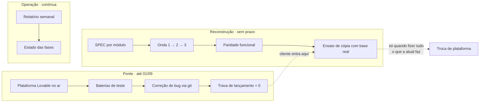
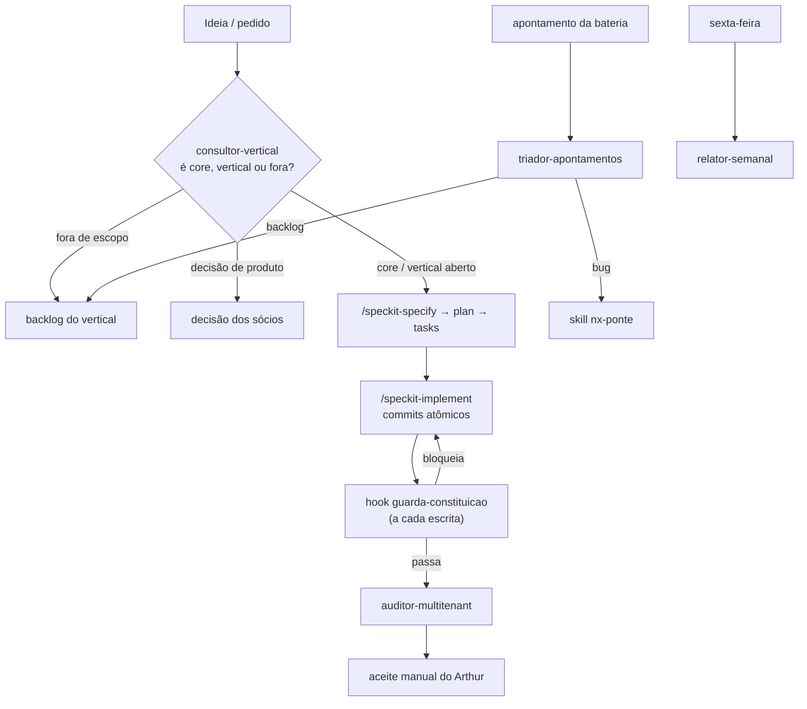

# O harness do NexClin

> **O que é este arquivo:** a explicação de por que `.claude/` tem a forma que
> tem. Quem for mexer na estrutura lê isto antes. Montado em 16/08/2026.

## Por que harness, e não "prompts melhores"

Entre 2022 e 2026 o paradigma mudou duas vezes: **engenharia de prompt →
engenharia de contexto → engenharia de harness**. Harness é o conjunto de
prompts, ferramentas, políticas de contexto, hooks, sandbox, subagentes,
laços de feedback e caminhos de recuperação que envolvem um modelo fixo para
que ele consiga *terminar* alguma coisa.

A consequência prática para este projeto: não adianta escrever instruções mais
detalhadas se nada **verifica** que elas foram seguidas. O que segura qualidade
é o laço de feedback, não o texto.

## O princípio que rege tudo aqui: a catraca

> Todo erro do agente é sinal permanente. Quando uma falha acontece, você
> constrói a peça que impede que ela se repita.

Cada regra, guarda e agente desta pasta **rastreia até uma falha real deste
projeto**. Nenhuma é preventiva-genérica. Isso é deliberado: acúmulo de regras
dilui a atenção de todas elas, e o custo aparece quando ninguém mais sabe quais
importam.

Corolário: quando uma peça deixar de rastrear a uma falha viva, **remova-a**.
Andaime obsoleto é dívida, não patrimônio.

## As três camadas

O projeto tem três frentes simultâneas com ritmos diferentes. Confundi-las é o
erro mais caro possível aqui.

**Ponte** é urgente e tem data. **Reconstrução** é importante e *não* tem
data — a decisão dos sócios foi explícita: a migração acontece com o máximo de
segurança para os usuários, sem pressa. **Operação** é contínua.

O harness precisa refletir isso: nada nesta pasta deve empurrar a migração mais
rápido do que é seguro. A skill `nx-modulo` abre com esse aviso justamente
porque a tentação de acelerar aparece quando o lançamento se aproxima.

## Onde cada coisa mora, e por quê

A divisão segue a orientação oficial da Anthropic sobre como dirigir o Claude
Code, adaptada ao que este repositório já tinha (Spec Kit + constituição).

| Peça | Serve para | Carrega quando | Aqui |
|---|---|---|---|
| `CLAUDE.md` | contexto sempre presente | toda sessão | já existia — contexto do produto |
| `.specify/memory/constitution.md` | a lei | referenciada | já existia — 6 princípios |
| `.claude/rules/*.md` | restrição por área do código | ao tocar os `paths` | banco, app, marca |
| `.claude/skills/*/SKILL.md` | procedimento de várias etapas | quando invocada | `nx-modulo`, `nx-ponte` |
| `.claude/agents/*.md` | trabalho paralelo com contexto próprio | quando delegado | 4 agentes |
| `.claude/settings.json` | automação determinística | evento de ciclo de vida | 1 hook + permissões |

A regra de bolso que separa os quatro últimos:

- **"Toda vez que X, faça Y"** → hook. Não peça educadamente ao modelo o que
  um script garante.
- **"Nunca faça Z"** → hook ou permissão, não frase em prompt.
- **Procedimento de 30 linhas** → skill, não `CLAUDE.md`.
- **Trabalho que suja contexto e só interessa pela conclusão** → agente.

Regras usam `paths:` no frontmatter para carregar só quando relevantes — regra
sem escopo é token desperdiçado em toda sessão.

## O grafo dos agentes

Não é hierarquia; é quem chama quem, e em que ponto do trabalho.

Duas propriedades importam neste desenho:

**Geração e avaliação são separadas.** O agente que escreve não é o que
audita. Modelos avaliam o próprio trabalho com viés otimista — por isso o
`auditor-multitenant` roda depois, com contexto próprio, e por isso o aceite
final é humano.

**O guarda é determinístico, o auditor é semântico.** O hook pega por regex o
que é sempre errado (RLS faltando, `USING (true)`, senha, segredo) e custa
milissegundos. O agente lê a cascata inteira e tenta furá-la — custa tokens e
só roda ao fechar fase. Colocar o barato antes do caro é o que torna o laço
sustentável.

## O hook, em detalhe

`.claude/hooks/guarda-constituicao.mjs`, disparado em `PostToolUse` sobre
`Write|Edit`. Quatro checagens, cada uma amarrada a um incidente real:

| Checagem | Incidente que a originou |
|---|---|
| RLS ausente em tabela com `clinic_id` | brecha crítica do MVP — usuário via dado de outra clínica |
| `USING (true)` | anula isolamento sem parecer errado no diff |
| caminho que define senha | linha `password set` no audit log do Lovable, 28/07/2026 |
| segredo literal | Princípio V — chave commitada fica no histórico para sempre |

Duas propriedades de projeto:

- **Sucesso é silencioso; falha é verbosa.** Ruído constante treina o operador
  a ignorar o aviso.
- **Exceção é possível, mas fica escrita.** `-- guarda:permitido <motivo>` na
  linha acima da policy. O motivo vai para o diff e o blame. Guarda sem escape
  vira guarda contornado por dentro.

Calibração medida em 16/08: **1 acusação nas 57 migrações**, e ela é
verdadeira — a policy `anon` sobre `anamnesis_responses`. Zero falso positivo
nas demais e nas duas edge functions.

## O que deliberadamente NÃO está aqui

Anti-padrões conhecidos de harness, e a decisão correspondente:

- **Inchaço de ferramentas** — dez ferramentas focadas superam cinquenta
  sobrepostas. Não criamos MCP nem tooling novo; o repositório já tem Spec Kit.
- **Acúmulo de regras** — três arquivos de regra, todos com `paths`. Não há
  regra genérica de "escreva bom código".
- **Duplicar o Spec Kit** — `nx-modulo` *enquadra* o fluxo speckit com os
  portões de domínio; não reimplementa o fluxo.
- **Vertical especulativo** — nada de código para nichos fechados. Os quatro
  arquivos em `docs/dominio/verticais/` são decisão documentada, não andaime.
- **Rotina agendada ainda não criada** — o `relator-semanal` existe como agente
  e funciona sob invocação. Vira rotina (execução agendada na nuvem) quando
  tiver rodado algumas vezes sob supervisão. Automatizar antes de confiar é
  como o harness ganha peso sem ganhar valor.

## Como estender sem estragar

1. A peça rastreia até uma falha que **aconteceu**? Se não, não entra.
2. Um script determinístico resolve? Então é hook, não instrução.
3. É restrição de área? Regra com `paths`. Procedimento? Skill. Trabalho
   paralelo? Agente.
4. Escreva o caso de teste junto — o guarda foi validado contra as 57
   migrações antes de ser ligado. Guarda não testado é guarda que bloqueia
   trabalho legítimo e é desligado na primeira semana.
5. Contradiz a constituição? Emende a constituição primeiro, com Sync Impact
   Report. Ela vence.

## Ativação

O hook só passa a valer quando o Claude Code recarregar as configurações —
reinicie a sessão, ou abra o menu `/hooks` num terminal interativo. Até lá os
arquivos existem mas não disparam.

## Fontes

Pesquisa de referência para a estrutura, agosto de 2026:

- [Steering Claude Code: when to use CLAUDE.md, skills, hooks, and subagents](https://claude.com/blog/steering-claude-code-skills-hooks-rules-subagents-and-more) — Anthropic
- [Effective context engineering for AI agents](https://www.anthropic.com/engineering/effective-context-engineering-for-ai-agents) — Anthropic
- [Agent Harness Engineering](https://addyosmani.com/blog/agent-harness-engineering/) — Addy Osmani
- [Agent Harness Engineering](https://www.oreilly.com/radar/agent-harness-engineering/) — O'Reilly Radar
- [Set up Claude Code in a monorepo or large codebase](https://code.claude.com/docs/en/large-codebases) — Claude Code Docs
- [Graph Engineering for Multi-Agent Systems](https://www.truefoundry.com/blog/graph-engineering-enterprise-guide) — TrueFoundry
- [Graph Engineering for AI Agents](https://www.eigent.ai/blog/graph-engineering-ai-agents) — Eigent
- [Claude Code Routines: scheduled cloud agents](https://makerkit.dev/blog/tutorials/claude-code-routines-guide) — MakerKit
- [awesome-harness-engineering](https://github.com/ai-boost/awesome-harness-engineering) — lista viva de padrões

Sobre grafos: a literatura de 2026 distingue **grafo de conhecimento** (o que o
sistema sabe) de **engenharia de grafos** no sentido de orquestração (quem são
os membros, seus mandatos e os caminhos de mensagem entre eles). O diagrama de
agentes acima é do segundo tipo. Frameworks de grafo explícito — LangGraph,
AutoGen GraphFlow, Google ADK — resolvem fan-out, roteamento condicional e
estado compartilhado entre dezenas de nós. **Este projeto não precisa disso
hoje**: são quatro agentes e um pipeline linear com um ponto de decisão. Adotar
maquinário de grafo agora seria escalar complexidade sem falha que a
justifique. Se um dia houver dezenas de módulos sendo reconstruídos em
paralelo, o desenho acima já está no formato que essas ferramentas consomem.
