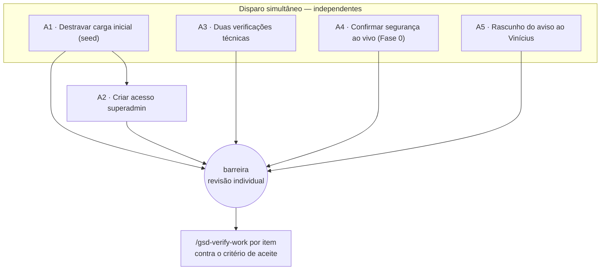

# MICRO-SPEC — Tarefas de Arthur (16/08) via time de agentes

> **Para quem executa:** um **novo chat** do Claude Code, nesta mesma pasta.
> **Por que novo chat:** conservar o limite da sessão original.
> **Como começar:** ver "Kickoff" no fim. O chat lê este arquivo e orquestra.
> **Regra-mãe:** nada fora do escopo de cada tarefa. Nenhuma toca a stack nova,
> nem tarefa de Erick/Vinícius, nem decisão de sócio.

---

## Modelo de execução — grafo de agentes, NÃO pipeline

Cada tarefa é um **agente isolado**, com contexto próprio, dono de UMA coisa.
Não há encadeamento além de **uma** aresta de dependência (A2 depende de A1).
Ninguém consome o resultado de outro. Ao voltar, cada resultado é **revisado
individualmente** — não se emenda um no outro. Só quando todos voltam e são
revisados é que se abre a **barreira de verificação**.



**Instrução de orquestração para o novo chat:**
- Disparar **A1, A3, A4, A5 em paralelo** — Agent tool, várias chamadas numa
  única mensagem. **A2 só depois de A1 voltar.**
- **Não usar o Workflow tool.** Ele roda uma orquestração corrida e automática —
  o oposto do que se quer aqui. Use spawns discretos do **Agent tool**, para
  revisar cada um sozinho.
- Cada agente recebe como prompt **apenas a sua seção** abaixo (objetivo +
  escopo IN/OUT + o que é automatizável + critério). O escopo OUT é limite
  rígido: se o agente perceber que precisa sair dele, ele **para e reporta**, não
  age.
- Onde a tarefa exige credencial ou ação humana (unpause, rodar SQL ao vivo,
  enviar mensagem), o agente **prepara e entrega os passos exatos** — não inventa
  credencial, não age fora do repositório.

---

## A1 · Destravar a carga inicial (seed)

- **Objetivo:** descobrir por que `scripts/seed.ts` não roda e deixá-lo rodando
  idempotente (plano Trial Padrão, `saas_settings`, 1 `superadmin_operator`).
- **Escopo IN:** ler `scripts/seed.ts`; validar a lógica idempotente; diagnosticar
  o bloqueio; preparar o comando de execução e a saída esperada.
- **Escopo OUT:** não alterar schema, não criar migração, não tocar a stack nova.
- **Primeira checagem (achado já conhecido):** **`.env.local` não existe nesta
  pasta.** O git tem "fix seed carrega .env.local" — provável causa da carga
  travada. Confirmar a ausência e listar as 4 variáveis que o arquivo precisa
  (`NEXT_PUBLIC_SUPABASE_URL`, `NEXT_PUBLIC_SUPABASE_ANON_KEY`,
  `SUPABASE_SERVICE_ROLE_KEY`, `SUPERADMIN_EMAIL`). Segunda hipótese: projeto
  Supabase pausado por inatividade (tier grátis, 7 dias).
- **Ação de Arthur:** criar `.env.local` com as 4 variáveis (fora do git); se o
  projeto estiver pausado, reativar no painel.
- **Critério de aceite (verify-work):** `seed.ts` roda **2x sem duplicar** —
  plano único, singleton intacto, um operador. Idempotência provada.

## A2 · Criar acesso superadmin — *depende de A1*

- **Objetivo:** garantir que existe o usuário auth do `SUPERADMIN_EMAIL` e o
  registro `superadmin_operators` ativo.
- **Escopo IN:** verificar, após o seed, que o operador existe e está `active`.
- **Escopo OUT:** **NUNCA definir senha por código** (Constituição, Princípio II).
- **Ação de Arthur:** definir a senha real via **reset no painel do Supabase** e
  guardar no gerenciador de senhas (a senha antiga está queimada).
- **Critério de aceite (verify-work):** login em `/superadmin/login` funciona;
  usuário comum invocando rota de superadmin → negado.

## A3 · As duas verificações técnicas

- **Objetivo:** definir o custo de manutenção durante a ponte até a migração.
- **Escopo IN:** (A) sincronização de mão dupla do repositório da plataforma
  Lovable; (B) acesso direto ao banco. Preparar a mudança de **texto trivial** da
  Verificação A como diff pronto; documentar os passos exatos de A e B.
- **Escopo OUT:** nenhuma alteração de dado; só o teste trivial.
- **Ação de Arthur:** enviar a mudança trivial pelo repositório e conferir se
  aparece no editor e no site publicado (A); entrar no painel do provedor de
  banco e conferir se o projeto aparece na lista, com exportação possível (B).
- **Critério de aceite (verify-work):** A — o texto trivial publica **sem
  consumir crédito**; B — o projeto aparece no painel. Registrar qual é o canal
  de correção para a fase de bugs (muda o número que vai aos sócios se A falhar).

## A4 · Confirmar os achados de segurança ao vivo (SPEC 002 Fase 0)

- **Objetivo:** confirmar, no banco ao vivo, se os Achados 1 e 2 seguem vivos.
- **Escopo IN:** as **duas queries de leitura** de
  [quickstart.md](../../specs/002-seguranca-anamnese-auditoria/quickstart.md) +
  o guia de interpretação. Agente `auditor-multitenant` revisa a leitura.
- **Escopo OUT:** **nenhuma escrita.** Não corrigir nada agora — a correção é a
  janela de 22–23/08. Só ler e registrar.
- **Ação de Arthur:** colar as duas queries no SQL do Lovable e trazer o resultado.
- **Critério de aceite (verify-work):** registro de uma página em
  `docs/seguranca/` — Achado 1 vivo ou corrigido, Achado 2 vivo ou corrigido, e
  o canal de correção. Nada além de leitura foi feito.

## A5 · Rascunho do aviso ao Vinícius

- **Objetivo:** deixar pronta a mensagem que evita que a bateria dele vire ruído.
- **Escopo IN:** redigir, a partir de [../referencia/INVENTARIO-UI.md](../referencia/INVENTARIO-UI.md)
  §5, o aviso dos três "não-bugs" (filtro "Este mês" esvaziando listas — D2; tela
  branca no 1º acesso — D8; seletores de período diferentes — D3) + a orientação
  de testar numa **clínica nova** criada por ele, não no dado de teste sujo.
- **Escopo OUT:** **NÃO enviar.** Só rascunho — mensagem a pessoa não é enviada
  por agente. Arthur revisa e manda.
- **Ação de Arthur:** revisar o texto e enviar no grupo/WhatsApp.
- **Critério de aceite (verify-work):** o rascunho cobre os 3 não-bugs + a
  orientação de dados; Arthur aprova como claro e pronto para enviar.

---

## Barreira de verificação

Quando **todos** voltarem e forem revisados um a um, e só então:

- Rodar **`/gsd-verify-work`** por item, validando contra o **critério de aceite**
  de cada seção acima — não contra "o agente disse que fez".
- Um item só é **concluído** quando passa. O que não passar volta ao seu agente
  com o gap apontado; não contamina os outros.
- A tarefa de Arthur bloqueada por terceiro (**preços viram configuração**, que
  espera Erick) **não entra** neste time — não é executável hoje por Arthur.

## Kickoff (colar no novo chat, mesma pasta)

```
Leia 2026-08-16-micro-spec-arthur.md e execute o time de agentes
exatamente como descrito: A1, A3, A4, A5 em paralelo (Agent tool, não Workflow),
A2 após A1, cada um limitado à sua seção. Revise cada retorno individualmente.
Ao final, pare na barreira e rode /gsd-verify-work por item contra o critério de
aceite. Nada fora do escopo de cada tarefa.
```
