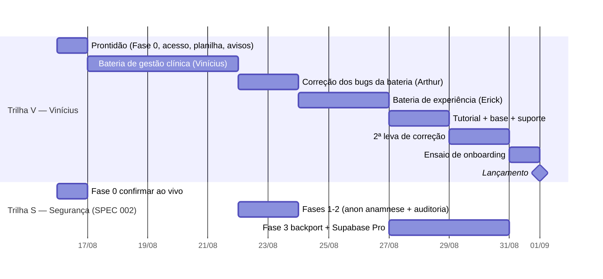

# Plano de execução — de agora até a bateria do Vinícius (e até 01/09)

> Montado em 16/08/2026. Ancorado no calendário do plano de lançamento e no que
> a revisão de segurança de 16/08 acrescentou. A pergunta que rege este
> documento: **o que fazer agora para o Vinícius começar a bateria amanhã (17/08)
> com o mínimo de atrito, sem travar o caminho até 01/09.**

## A virada de chave

A bateria do Vinícius é de **gestão clínica** — "o sistema dá conta da rotina
real de uma clínica?". Ela **não é de segurança**. Isso separa o trabalho em duas
trilhas que correm em paralelo e não se bloqueiam:

- **Trilha V — deixar o Vinícius produtivo** (começa amanhã, é o urgente de hoje).
- **Trilha S — segurança para o lançamento** (SPEC 002, mira 01/09, não 17/08).

O erro a evitar: tratar a SPEC 002 como pré-requisito da bateria. Não é. O Achado
1 (anon na anamnese) protege paciente **real**, e paciente real só existe em
01/09. Corrigi-lo pode — e deve — esperar a janela de correção de 22–23/08, para
não mexer na plataforma na véspera do teste do Vinícius.

## HOJE (16/08) — a lista do Arthur

1. **Rodar a Fase 0 da SPEC 002** — as duas queries de leitura
   ([quickstart](../regras/002-seguranca-anamnese-auditoria.md)). 30
   segundos, não muda nada. Confirma se os dois achados seguem vivos no banco ao
   vivo. Sem isso, a Trilha S anda no escuro.
2. **Confirmar acesso do Vinícius** — ele consegue entrar na plataforma e sabe
   por onde começar?
3. **Confirmar a planilha de apontamentos** — distribuída no grupo (o plano
   previa 14/08)? É onde ele registra bug × backlog.
4. **Avisar o Vinícius dos "não-bugs" conhecidos** (abaixo) — para ele não gastar
   a bateria reportando coisa que já sabemos, e não gerar falso-positivo que
   entope a janela de correção.

## Os "não-bugs" a avisar antes de amanhã

Três coisas que o walkthrough de 16/08 já mapeou. Se o Vinícius bater nelas sem
aviso, vira ruído na planilha:

| O que ele vai ver | O que é | O que dizer |
|---|---|---|
| Listas de pacientes/consultas **vazias** | filtro "Este mês" é o padrão e os dados de teste são antigos (D2) | "troque o período para 'Este ano'; o filtro no cadastro é um ajuste já anotado" |
| **Tela branca** no primeiro acesso | crash intermitente de hooks no carregamento frio (D8) | "recarregue a página; é bug conhecido, já anotado" |
| Seletores de período **diferentes** entre telas | três vocabulários convivendo (D3) | "é inconsistência conhecida; anote se atrapalhar, mas não é novidade" |

Isso não é pedir para ele ignorar — é dar contexto para a bateria dele mirar o
que **ainda não sabemos**: falta campo? falta etapa? o fluxo bate com a
consultoria dele?

## Decisão para hoje: em que dados o Vinícius testa?

O banco ao vivo tem ~16 clínicas de teste com dado sujo ("Clínica Teste Bypass"
etc.). Isso atrapalha um teste de "rotina real". **Recomendação:** o Vinícius cria
uma **clínica nova pelo próprio cadastro** e roda uma rotina real de ponta a ponta
(configurar catálogos → cadastrar paciente → agendar → atender → fechar → ver no
financeiro). É o teste mais fiel e não depende de a gente preparar dado. Alternativa
(pior): usar uma das clínicas de teste existentes — mais rápido, menos realista.

## O calendário das duas trilhas

Repare: a SPEC 002 (Trilha S) só toca a plataforma na janela de 22–23/08 — a
mesma da correção pós-Vinícius. Assim a bateria dele roda numa plataforma estável,
e a correção de segurança entra junto com os bugs que ele achar.

## Quem faz o quê (por sócio)

- **Vinícius** — 17–21/08, bateria de gestão clínica. Registra na planilha,
  separando bug de backlog. O agente `triador-apontamentos` ajuda a classificar
  o que chegar.
- **Arthur** — hoje a lista acima; 22–23/08 a janela de correção (bugs do
  Vinícius + SPEC 002 Fases 1–2); antes de 01/09, backport e **ligar o Supabase
  Pro** (backup diário — o tier atual não tem PITR, ver TESTES 2 e 3).
- **Erick** — 24–26/08, bateria de experiência sobre a versão já corrigida; em
  paralelo, preços/trial, conta bancária e material comercial (itens do plano
  ainda pendentes).

## Trava de lançamento (o número que todos acompanham)

Bugs abertos que impedem ou atrapalham muito o uso precisam chegar a **zero**
antes de 01/09. A SPEC 002 Achado 1 entra nessa conta — é dado de saúde exposto.
O Achado 2 (auditoria) é forte candidato, mas se não couber antes do dia, entra
como primeiro item pós-lançamento **com data**, não como "depois".

## O que este plano NÃO inclui (de propósito)

- **Reconstrução da stack nova** — segue sem prazo, em paralelo, como decidido.
  Nada aqui a acelera.
- **SPEC 003 (superadmin blindado)** — é da stack nova, não bloqueia 01/09. O
  superadmin do Lovable já opera o essencial para o lançamento.
- **Bateria do Erick em detalhe** — alinhamos quando a do Vinícius fechar, porque
  o que ele achar muda as telas que o Erick vai avaliar.
