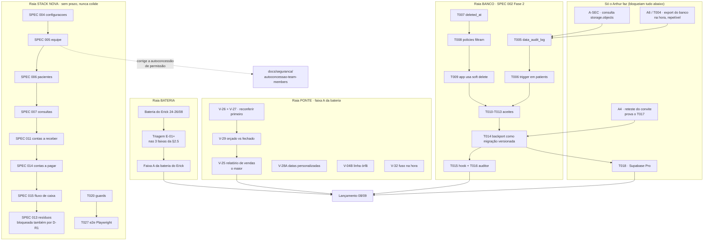

# Mapa de execução: o que está pendente, em que ordem, e o que roda em paralelo

> **O que é este arquivo:** o inventário completo do trabalho pendente, o grafo
> de dependências entre ele, e as raias que podem correr ao mesmo tempo sem
> colidir. É o documento de orquestração do projeto.
> Montado em 25/08/2026. Contagem feita direto nos `tasks.md`, não de memória.

---

## 0. O quadro em números

| Spec | Estado | Tarefas | Concluídas | Pendentes |
|---|---|---:|---:|---:|
| **001** fundação e superadmin | em execução | 28 | 18 | **10** |
| **002** segurança, anamnese, auditoria | quase parada | 18 | 1 | **17** |
| **003** superadmin blindado | só o `spec.md` | sem `tasks.md` | 0 | tudo |
| **013** resíduos e conformidade | escrita, bloqueada | sem `tasks.md` | 0 | tudo |
| **004 a 012** fila da Onda 1 | 9 specs não escritas | zero | 0 | tudo |

Somando: **27 tarefas nomeadas pendentes**, mais 11 specs que ainda não têm
tarefa porque não foram escritas. É muito, e é por isso que a ordem importa
mais que a velocidade.

---

## 1. As três frentes, e por que não competem

O erro de leitura mais caro aqui é achar que tudo disputa o mesmo tempo. Não
disputa, e a razão é física: **cada frente vive num diretório diferente**.

| Frente | Onde o arquivo mora | Prazo | Quem destrava |
|---|---|---|---|
| **Ponte** | `../nexclin-lovable` | **08/09** | Claude, via `scripts/ponte.sh` |
| **Banco** | `supabase/migrations` nos dois repositórios | 08/09 para a Fase 2 | Arthur destrava o gate, Claude executa |
| **Stack nova** | `app/`, `lib/`, `specs/` | sem prazo | Claude |

Ponte e Stack nova tocam **árvores de arquivo distintas**. Um agente
trabalhando em `../nexclin-lovable/src/pages/Relatorios.tsx` e outro
trabalhando em `specs/004-configuracoes-clinica/spec.md` não têm como colidir.
Essa é a paralelização que já existe de graça e que não estava sendo usada.

---

## 2. O grafo de dependências

Três leituras que o grafo entrega e uma lista não entregava:

1. **`A6` (o export) é gate, e não é gargalo.** Corrigido pelo Arthur em
   25/08: o export é feito na hora, pela função de exportar dados, sem espera
   por e-mail e sem limite de um a cada 24 horas. A versão anterior deste
   documento dizia o contrário, herdando o erro do handoff de 20/08, e a
   consequência era real: a raia BANCO inteira, 17 tarefas, parecia bloqueada
   por uma espera que não existe. Continua sendo pré-requisito, porque o ponto
   de retorno importa antes de escrever no banco. Só é barato.
2. **A raia STACK NOVA não tem nenhuma seta vindo da Ponte.** Ela pode começar
   agora, hoje, sem esperar nada. É trabalho de escrever spec, e é onde a
   paralelização rende mais.
3. **`T014` é a costura.** É ele que transforma a correção feita na Lovable em
   migração versionada aqui. Sem ele, a Fase 2 fica só na plataforma que morre
   em outubro, e o trabalho evapora.

---

## 3. Inventário item a item

### 3.1 SPEC 001, fundação e superadmin (10 pendentes de 28)

| Tarefa | O que falta | Bloqueada por | Raia |
|---|---|---|---|
| T012 | Senha real do superadmin via recovery. Ele nunca logou. | Arthur | HUMANO |
| T017 aceite | Provar o diff de `update_email` em `superadmin_audit_log` | nada | NOVA |
| T019 | Login do usuário comum e rotas da clínica. Reset já funciona. | nada | NOVA |
| T020 | `ProtectedRoute`, `RequirePermission`, `OnboardingGuard`. Só existe `useSuperAdmin`. | nada | NOVA |
| T023 | 9 das 11 telas do painel | T019 | NOVA |
| T024 | Seção Perfis. Sem modelo na referência, precisa ser desenhada. | SPEC 003 | NOVA |
| T025 | Banner âmbar, sair da conta, limpeza de cache | T019 | NOVA |
| T026 | Esqueleto do app da clínica | T020 | NOVA |
| T027 | e2e em Playwright. Não existe nem o config. | T020 | NOVA |
| T028 | Os 7 critérios de aceite | todas acima | HUMANO |

**Observação que muda a prioridade:** o T021 (testes de permissão em Vitest)
foi fechado em 20/08 com 19 testes, mas o **T020 não existe**. Ou seja, temos
teste de uma regra que nenhuma tela consome ainda. O T020 é o item de maior
retorno da spec inteira.

### 3.2 SPEC 002, segurança e auditoria (17 pendentes de 18)

Bloco público (T001 a T003): T002 é decisão do Arthur sobre `public_token`,
e sem ela o T003 não abre.

Bloco de auditoria (T004 a T013): **T004 é gate absoluto**, o export.
Depois dele, T005 a T009 são banco e app, T010 a T013 são aceites manuais.

Bloco de backport (T014 a T016): traz tudo para `supabase/migrations` daqui.

T018: Supabase Pro ligado antes do lançamento. Não é código, é condição.

### 3.3 SPEC 003, superadmin blindado

Tem `spec.md`, não tem `plan.md` nem `tasks.md`. Declara explicitamente que
não tem prazo de lançamento porque o superadmin é ferramenta interna. **Fica
para depois de 08/09**, e destrava o T024 da 001.

### 3.4 SPEC 013, resíduos

Escrita em 25/08. Bloqueada por três coisas: a decisão D-R1 (em qual plano
entra), a emenda à constituição para a 16ª ModuleKey, e a dívida de
`storage.objects` sem filtro por `bucket_id`.

### 3.5 A fila 004 a 012, mais duas que faltavam número

A `fila-especificacoes.md` reserva 004 a 012. Duas specs que o Arthur
priorizou em 25/08 (**os módulos financeiros**) não tinham número porque
estavam fora da Onda 1. Ficam assim:

| Nº | Spec | Onda | Motivo do número |
|---|---|---|---|
| 004 a 012 | fila existente | 1 | já reservados |
| **014** | `contas-pagar` | 2 | numerado agora, era só texto no BACKLOG |
| **015** | `fluxo-caixa` | 2 | idem, depende das duas pontas |

---

## 4. "Módulos financeiros primeiro": as duas leituras, e qual vale

O Arthur decidiu em 25/08 resolver os módulos financeiros antes de partir para
a execução da SPEC 013. A frase tem duas leituras, e elas apontam para semanas
diferentes:

**Leitura A, a da Ponte:** o financeiro que está pendente **agora** é a faixa A
da bateria: V-26, V-27, V-29, V-25 e V-28A, que são relatórios financeiros da
plataforma que vai ao ar em 08/09. Isso é o trabalho corrente e tem data.

**Leitura B, a da Stack nova:** os módulos `contas_pagar` e `fluxo_caixa` como
specs novas (014 e 015). Só que ambos dependem de 004, 005, 006, 007 e 011 para
existirem, porque sem catálogos, equipe, pacientes, consultas e recebíveis não
há o que pagar nem o que fluir.

**Recomendação:** as duas, em ordem. **A leitura A é agora**, porque tem data e
é o que o fundador vai usar. **A leitura B começa depois de 08/09**, seguindo a
fila, e termina em 014 e 015, e é aí que a SPEC 013 destrava. Tratar a leitura B
como se fosse fazível esta semana é prometer o que a dependência não permite.

---

## 5. Raias que podem correr ao mesmo tempo

Duas raias podem correr juntas quando **não tocam o mesmo arquivo nem o mesmo
banco**. Esse é o único teste.

| Raia | Diretório | Pode correr junto com | Nunca junto com |
|---|---|---|---|
| **P1 Ponte, relatórios** | `../nexclin-lovable/src` | N1, N2, B1 | outra tarefa no mesmo arquivo de relatório |
| **P2 Ponte, correções isoladas** | `../nexclin-lovable/src` | N1, N2 | P1 se o arquivo for o mesmo |
| **B1 Banco, Fase 2** | `supabase/migrations` (ambos) | N1, N2 | qualquer coisa que escreva no banco antes do export |
| **N1 Stack nova, specs** | `specs/` | tudo | nada |
| **N2 Stack nova, app** | `app/`, `lib/` | tudo | nada |
| **H Arthur** | painel Supabase, plataforma | tudo | nada |

**A regra prática:** N1 e N2 são sempre seguras de disparar em paralelo com
qualquer coisa. P1 e P2 exigem conferir o arquivo. B1 exige o export feito.

O procedimento de como disparar isso está em
[`.claude/skills/nx-paralelo/SKILL.md`](../../.claude/skills/nx-paralelo/SKILL.md).

---

## 6. Calendário proposto até 08/09

Premissa: Claude trabalha as raias, Arthur destrava os gates. Datas são
proposta, não compromisso, e a primeira coluna é o que trava se atrasar.

| Data | Arthur (gate) | Claude, raia principal | Claude, raia paralela |
|---|---|---|---|
| **25/08 hoje** | **A-SEC**, depois **A6/T004 o export** (leva minutos) | triagem da bateria do Erick | ✅ SPEC 001 T019/T020/T023/T024/T025/T026/T027 |
| 26/08 | A4 reteste do convite | Fase 2: T005, T006, T007 | SPEC 004 |
| 27/08 | A3 consulta do V-24 | Fase 2: T008, T009 | SPEC 005 |
| 28/08 | aceites T010 a T013 | V-26 e V-27 reconferir, V-29 | T020 guards |
| 29/08 | | V-25 relatório de vendas | T020 |
| 30 e 31/08 | | V-25 continua, V-28A | T027 e2e |
| 01/09 | | faixa A da bateria do Erick | SPEC 006 |
| 02 e 03/09 | | T014 a T016 backport | SPEC 006 |
| 04/09 | **T018 Supabase Pro** | V-04B, V-32 | |
| 05/09 | | **congelamento**, só regressão | |
| 06 e 07/09 | | reserva para o que escorregar | |
| **08/09** | | **lançamento** | |

Dois dias de reserva no fim são deliberados. O histórico do projeto tem uma
queda de app de 1h35 em 20/08 causada por pressa, e reserva é mais barata que
incidente.

Depois de 08/09, a ordem é: SPEC 003, depois a fila 006 a 012, depois 014 e
015, e então a SPEC 013 destrava.

---

## 7. Como manter este mapa vivo

Ele mente no dia em que um `tasks.md` mudar e ninguém atualizar aqui. Duas
defesas:

1. A contagem da §0 é reproduzível por comando, não por memória:
   `grep -cE '^\s*-\s*\[[xX]\]' specs/*/tasks.md`
2. Quem fechar uma fase atualiza a linha correspondente **no mesmo commit**.
   Mapa desatualizado é pior que mapa nenhum, porque dá confiança falsa.
